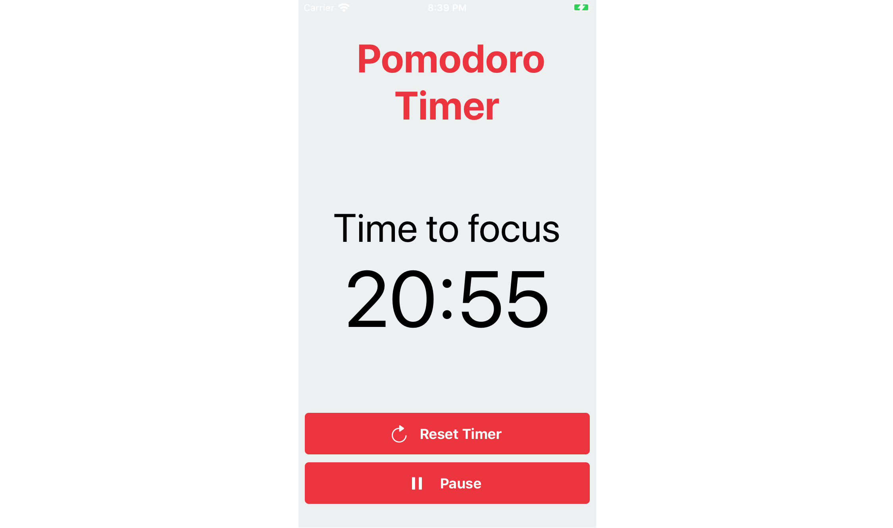

# Easy Pomodoro Timer

Want to get more done? Try using the Pomodoro technique! 

It's simple: use a block of time to work with total focus - no phone, no social media, no distractions. After each block, take a short break.

A standard Pomodoro uses 25 minutes of focus, followed by a 5 minute break, but with this app, you can set both your focused sessions and breaks from one minute up to one hour.

More focus, better productivity: all thanks to the Pomodoro technique!

Download Easy Pomodoro Timer [on the App Store](http://www.wvd.io/pomodoro)

Need support? [Send an email](mailto:pomodorosupport@woutervandijke.nl)!
